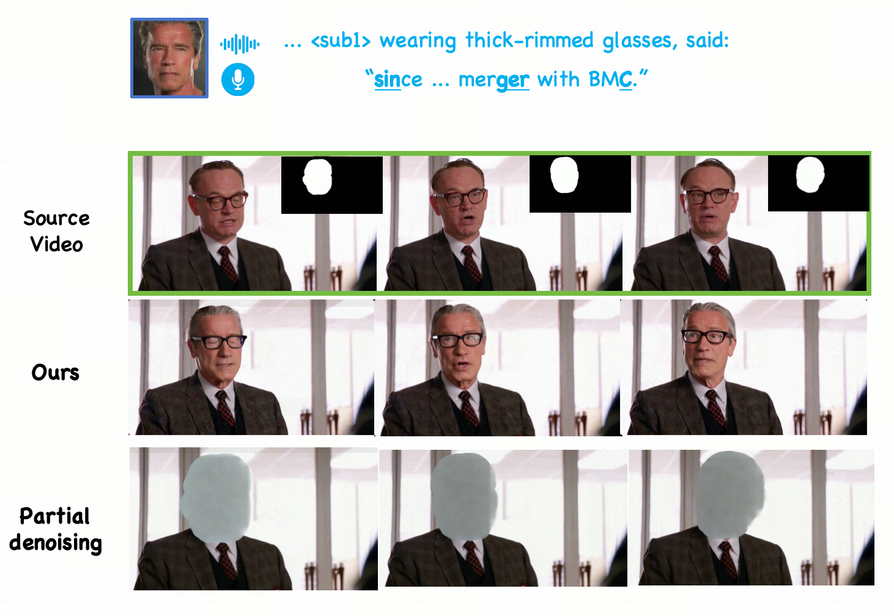
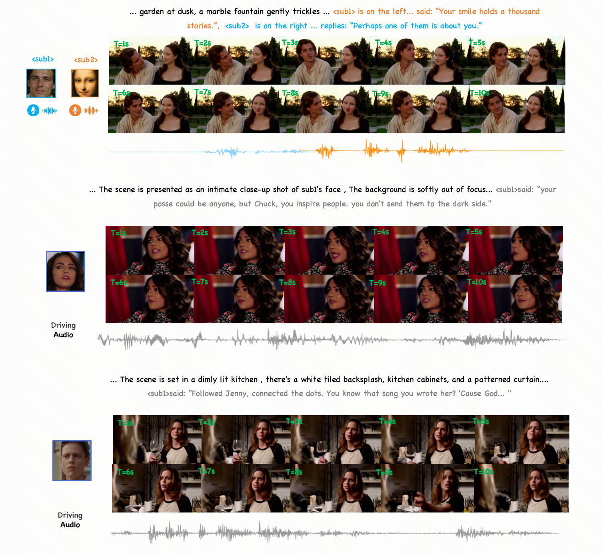
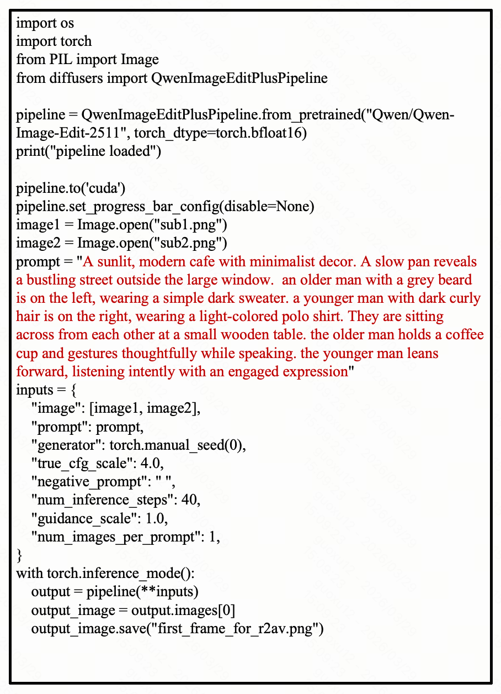
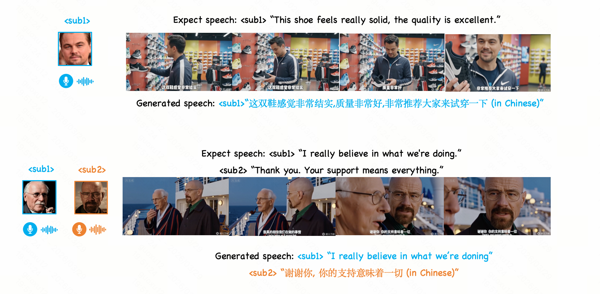
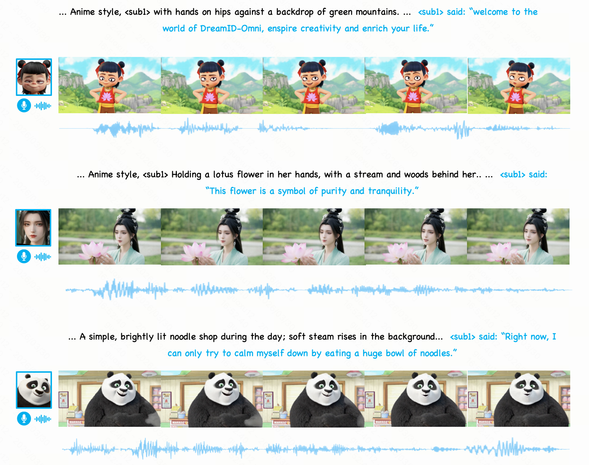

# For compliance with the ICML rebuttal policy, videos are converted into figures.

## Figure 1. Partial denoising for RV2AV.

## Figure 2. Long-video generation examples (up to 10s).

## Figure 3. Qwen-Image prompt used for baseline first-frame generation.

## Figure 4. Wan2.6 failure cases.

## Figure 5. Generalization to highly stylized subjects.

## Table 1. Preservation of non-edited regions in RV2AV.

| Method | Non-Edit Change@10 ↓ | Non-Edit MAE ↓ |
| --- | ---: | ---: |
| VACE | <u>0.094</u> | <u>0.032</u> |
| HunyuanCustom | 0.113 | 0.037 |
| Ours | **0.076** | **0.028** |

## Table 2. Ablation `M`

| M | ID1-Sim ↑ | ID2-Sim ↑ | ID3-Sim ↑ | T-Sim ↑ |
| --- | ---: | ---: | ---: | ---: |
| Vanilla concat | 0.593 | 0.587 | 0.601 | 0.211 |
| 100 | 0.603 | 0.605 | 0.597 | 0.384 |
| 150 | 0.607 | 0.601 | 0.603 | 0.402 |
| 300 | 0.598 | 0.611 | 0.604 | 0.397 |
| 500 | 0.594 | 0.604 | 0.598 | 0.404 |
| 1000 | 0.596 | 0.574 | 0.463 | 0.335 |

## Table 3. Evaluation for larger-subject settings by scaling margin `M`. single-subject absolute similarity is higher than the ~0.61 multi-subject level because the multi-subject benchmark contains more profile-view dialogue scenes.

| Margin Setting | M | 3M |4M | 5M |
| --- | ---: | ---: | ---: | ---: |
| ID-Sim (Single-Subject) ↑ | 0.674 | 0.663 | 0.671 | 0.667 |

## Table 4. Results on the public Mocha benchmark for RA2V and talking avatar. For talking avatar methods, we do not report ID-Sim or ViCLIP because the first frame is fixed.

| Method | AES ↑ | ViCLIP ↑ | ID-Sim ↑ | Sync-C ↑ | Sync-D ↓ |
| --- | ---: | ---: | ---: | ---: | ---: |
| OmniHuman(close source) | 0.545 | - | - | **6.526** | **7.784** |
| Hallo3 | 0.381 | - | - | 5.189 | 9.212 |
| FantasyTalking | 0.455 | - | - | 3.202 | 10.914 |
| HunyuanCustom | 0.358 | 13.525 | <u>0.624</u> | 4.562 | 9.892 |
| Humo-17B | <u>0.589</u> | <u>15.179</u> | 0.616 | 6.252 | <u>8.577</u> |
| Ours | **0.597** | **16.447** | **0.647** | <u>6.314</u> | 8.641 |

## Table 5. Comparison with TTS baselines under the R2AV setting.

| Method | CLAP ↑ | T-Sim (S) ↑ | WER ↓ 
| --- | ---: | ---: | ---: |
| CosyVoice | <u>0.256</u> | **0.537** | <u>0.044</u> |
| F5-TTS | 0.242 | 0.486 | **0.037** |
| Ours | **0.278** | <u>0.493</u> | 0.052 |
